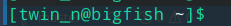

click here for official docs -> [Official docs](https://docs.microsoft.com/en-us/windows/wsl/install-win10)

> ### Reading guide:
 - running/executing a command means pasting the highlighted command into the terminal/powershell and pressing *Enter*


> ## **Configuring WSL 2** -


1. opening powershell as admin
    - press `win + x` and click on **"powershell as admin"** 
    **or** 
    - search for **"powershell"** in windows search bar
    - right click on **"powershell"** 
    - click on run as administrator  
2. enabling wsl
    - paste `dism.exe /online /enable-feature /featurename:Microsoft-Windows-Subsystem-Linux /all /norestart` in powershell and press enter
    - wait for it to complete
    - paste `dism.exe /online /enable-feature /featurename:VirtualMachinePlatform /all /norestart` in powershell and press enter
3. **Restart** pc 
4. Download the [kernel update](https://wslstorestorage.blob.core.windows.net/wslblob/wsl_update_x6.msi) and install it.
5. set wsl version to 2
    - paste `wsl --set-default-version 2` in powershell and press enter
6. installing ubuntu
    - Go to windows searchbar and search for **"store"**
    - find **"microsoft store"** from the results and open it
    - locate the search icon at top-right corner of the app
    - click on it and search for **"ubuntu"** 
    - you might see 3 different apps named ubuntu. click on any of them and click on **get** to install
7. opening ubuntu and creating account
    - go to windows searchbar, search for **"ubuntu"** and click on *ubuntu* from the results
    - a console window will appear and ask you to enter *UNIX username*
    - type the username you want to set and press enter
    - it wil now ask for password. enter the password you want to set. by default the console will not show you what password you are typing, probably as a security measure. dont panic if you dont see the cursor or characters on screen when you type. just type the password and press *Enter*.
    - now it will ask for password validation. just retype the passwor and press *Enter*.
    - hopefully you'll be greeted with a ubuntu shell now that will look somewhat like this 


> ## **Installing required packages** - 
1. install C and C++ compiler - 
  - run `sudo apt-get update` 
  - run `sudo apt-get install g++ make cmake`

## **installing and Configuring exercism** - 
1. installing and configuring exercism -
  - download [exercism package](https://github.com/exercism/cli/releases/download/v3.0.13/exercism-linux-64bit.tgz)
  - 


# Dillinger


[](https://travis-ci.org/joemccann/dillinger)

Dillinger is a cloud-enabled, mobile-ready, offline-storage, AngularJS powered HTML5 Markdown editor.

  - Type some Markdown on the left
  - See HTML in the right
  - Magic

# New Features!

  - Import a HTML file and watch it magically convert to Markdown
  - Drag and drop images (requires your Dropbox account be linked)


You can also:
  - Import and save files from GitHub, Dropbox, Google Drive and One Drive
  - Drag and drop markdown and HTML files into Dillinger
  - Export documents as Markdown, HTML and PDF

Markdown is a lightweight markup language based on the formatting conventions that people naturally use in email.  As [John Gruber] writes on the [Markdown site][df1]

> The overriding design goal for Markdown's
> formatting syntax is to make it as readable
> as possible. The idea is that a
> Markdown-formatted document should be
> publishable as-is, as plain text, without
> looking like it's been marked up with tags
> or formatting instructions.

This text you see here is *actually* written in Markdown! To get a feel for Markdown's syntax, type some text into the left window and watch the results in the right.

### Tech

Dillinger uses a number of open source projects to work properly:

* [AngularJS] - HTML enhanced for web apps!
* [Ace Editor] - awesome web-based text editor
* [markdown-it] - Markdown parser done right. Fast and easy to extend.
* [Twitter Bootstrap] - great UI boilerplate for modern web apps
* [node.js] - evented I/O for the backend
* [Express] - fast node.js network app framework [@tjholowaychuk]
* [Gulp] - the streaming build system
* [Breakdance](https://breakdance.github.io/breakdance/) - HTML to Markdown converter
* [jQuery] - duh

And of course Dillinger itself is open source with a [public repository][dill]
 on GitHub.

### Installation

Dillinger requires [Node.js](https://nodejs.org/) v4+ to run.

Install the dependencies and devDependencies and start the server.

```sh
$ cd dillinger
$ npm install -d
$ node app
```

For production environments...

```sh
$ npm install --production
$ NODE_ENV=production node app
```

### Plugins

Dillinger is currently extended with the following plugins. Instructions on how to use them in your own application are linked below.

| Plugin | README |
| ------ | ------ |
| Dropbox | [plugins/dropbox/README.md][PlDb] |
| GitHub | [plugins/github/README.md][PlGh] |
| Google Drive | [plugins/googledrive/README.md][PlGd] |
| OneDrive | [plugins/onedrive/README.md][PlOd] |
| Medium | [plugins/medium/README.md][PlMe] |
| Google Analytics | [plugins/googleanalytics/README.md][PlGa] |


### Development

Want to contribute? Great!

Dillinger uses Gulp + Webpack for fast developing.
Make a change in your file and instantaneously see your updates!

Open your favorite Terminal and run these commands.

First Tab:
```sh
$ node app
```

Second Tab:
```sh
$ gulp watch
```

(optional) Third:
```sh
$ karma test
```
#### Building for source
For production release:
```sh
$ gulp build --prod
```
Generating pre-built zip archives for distribution:
```sh
$ gulp build dist --prod
```
### Docker
Dillinger is very easy to install and deploy in a Docker container.

By default, the Docker will expose port 8080, so change this within the Dockerfile if necessary. When ready, simply use the Dockerfile to build the image.

```sh
cd dillinger
docker build -t joemccann/dillinger:${package.json.version} .
```
This will create the dillinger image and pull in the necessary dependencies. Be sure to swap out `${package.json.version}` with the actual version of Dillinger.

Once done, run the Docker image and map the port to whatever you wish on your host. In this example, we simply map port 8000 of the host to port 8080 of the Docker (or whatever port was exposed in the Dockerfile):

```sh
docker run -d -p 8000:8080 --restart="always" <youruser>/dillinger:${package.json.version}
```

Verify the deployment by navigating to your server address in your preferred browser.

```sh
127.0.0.1:8000
```

#### Kubernetes + Google Cloud

See [KUBERNETES.md](https://github.com/joemccann/dillinger/blob/master/KUBERNETES.md)


### Todos

 - Write MORE Tests
 - Add Night Mode

License
----

MIT


**Free Software, Hell Yeah!**

[//]: # (These are reference links used in the body of this note and get stripped out when the markdown processor does its job. There is no need to format nicely because it shouldn't be seen. Thanks SO - http://stackoverflow.com/questions/4823468/store-comments-in-markdown-syntax)


   [dill]: <https://github.com/joemccann/dillinger>
   [git-repo-url]: <https://github.com/joemccann/dillinger.git>
   [john gruber]: <http://daringfireball.net>
   [df1]: <http://daringfireball.net/projects/markdown/>
   [markdown-it]: <https://github.com/markdown-it/markdown-it>
   [Ace Editor]: <http://ace.ajax.org>
   [node.js]: <http://nodejs.org>
   [Twitter Bootstrap]: <http://twitter.github.com/bootstrap/>
   [jQuery]: <http://jquery.com>
   [@tjholowaychuk]: <http://twitter.com/tjholowaychuk>
   [express]: <http://expressjs.com>
   [AngularJS]: <http://angularjs.org>
   [Gulp]: <http://gulpjs.com>

   [PlDb]: <https://github.com/joemccann/dillinger/tree/master/plugins/dropbox/README.md>
   [PlGh]: <https://github.com/joemccann/dillinger/tree/master/plugins/github/README.md>
   [PlGd]: <https://github.com/joemccann/dillinger/tree/master/plugins/googledrive/README.md>
   [PlOd]: <https://github.com/joemccann/dillinger/tree/master/plugins/onedrive/README.md>
   [PlMe]: <https://github.com/joemccann/dillinger/tree/master/plugins/medium/README.md>
   [PlGa]: <https://github.com/RahulHP/dillinger/blob/master/plugins/googleanalytics/README.md>
