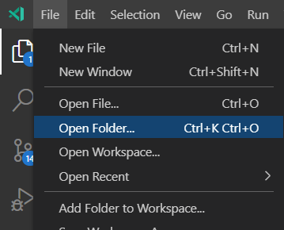
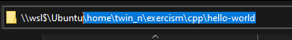

> ### Reading guide:
 - running/executing a command means pasting the highlighted command into the terminal/powershell and pressing *Enter*

 

> ## **Configuring WSL 2** -
 

[Official docs for configuring wsl2](https://docs.microsoft.com/en-us/windows/wsl/install-win10)

1. opening powershell as admin
    - press `win + x` and click on **"powershell as admin"** 

    **or** 
    - search for **"powershell"** in windows search bar
    - right click on **"powershell"** 
    - click on run as administrator  

    powershell might take some time to initialize after the window appears. *be patient*
2. enabling wsl
    - run `dism.exe /online /enable-feature /featurename:Microsoft-Windows-Subsystem-Linux /all /norestart` in powershell and press enter
    - wait for it to complete
    - run `dism.exe /online /enable-feature /featurename:VirtualMachinePlatform /all /norestart` in powershell and press enter
3. **Restart** pc 
4. Download the [kernel update](https://wslstorestorage.blob.core.windows.net/wslblob/wsl_update_x64.msi) and install it.
5. setting wsl version to 2
    - paste `wsl --set-default-version 2` in powershell and press enter
6. installing ubuntu
    - Go to windows searchbar and search for **"store"**
    - find **"microsoft store"** from the results and open it
    - locate the search icon at top-right corner of the app
    - click on it and search for **"ubuntu"** 
    - you might see 3 different apps named ubuntu. click on any of them and click on **get** to install
7. opening ubuntu and creating account
    - go to windows searchbar, search for **"ubuntu"** and click on *ubuntu* from the results
    - a console window will appear and ask you to enter *UNIX username*
    - type the username you want to set and press enter. remember the username you entered. i will be referring to this username by `your username` in the next parts.

      
    - it wil now ask for password. enter the password you want to set. and then enter again when asked to retype. by default the console will not show you what password you are typing, probably as a security measure. dont panic if you dont see the cursor or characters on screen when you type. just type the password and press *Enter*.
    
      
    - hopefully you'll be greeted with a ubuntu shell now that will look somewhat like this 
      
      

  

> ## **Opening wsl directories in code editor/file explorer**  
- open file explorer] 
- go to the URLbar of file explorer and paste `\\wsl$\Ubuntu\home` 

  
- go to folder named after `your username`. in my case it was *twin_n*
  
- to open wsl directories in code editor, follow the same steps in the `open folder` prompt of your code editor 

  
  

 

> Note: for some reason `ctrl+shift+v` doesnt work when trying to paste command in wsl2. luckily you can right click anywhere on the terminal window to paste a command

 

> ## **Installing required packages** -
  - run `sudo apt-get update`. enter password if prompted for and wait till it completes.
  - run `sudo apt-get install g++ make cmake`. just have some faith in me and press *Enter* when asked if you want to continue. it might take some time to install everything.

  

> ## **installing and Configuring exercism** - 
1. Downloading exercism -
    - download [exercism package](https://github.com/exercism/cli/releases/download/v3.0.13/exercism-linux-64bit.tgz)
    - open your ubuntu terminal (the ubuntu app you downloaded earlier) and run `mkdir junk`. this will open a folder named junk in your wsl directory.
    - copy the exercism file you download in the first step.
    - go to the wsl directory (follow the steps in `Opening wsl directories in code editor/file explorer`). go to the junks folder and paste the exercism package file you copeid earlier.
2. Installing exercism - 
    - go the ubuntu app and run the following commands one after another.
    - `cd junk`
    - `sudo tar -xf exercism-linux-64bit.tgz`
    - `cd ../`
    - `mkdir -p ~/bin`
    - `sudo mv junk/exercism ~/bin`
    - `touch .bash_profile`
    - `echo 'export PATH=~/bin:$PATH' >> .bash_profile`
    - `echo 'source ~/.bash_profile' >> .bash_profile`
    - close the ubuntu app and reopen it from searchbar.
3. Configuring exercism - 
    - go to [exercism settings](https://exercism.io/my/settings) and copy the CLI token 

      
    - run `exercism configure --token=YOUR_API_TOKEN`. replace `YOUR_API_TOKEN` by the CLI Token you copied in the previous step. in my case i ran `exercism configure --token=af348bc1-d8cb-49c3-ba79-38ff2b223dc9`.
    - run `mkdir exercism` and then run `exercism configure -w ./exercism`.

  

> ## **Downloading and submitting assignment**:
1. downloading exercise - 
    - go to any of the exercises(for example [this](https://exercism.io/my/solutions/b2351b2c6bae4b719de1d1741e681cf5)) and you'll find a link to download the exercise files on right side of the page. copy the download link from there.

      
    - go to the ubuntu app and run the copied link 

      
    - now if you open your wsl directory in file explorer and go to the exercism folder you will find you exercises there :D
2. submitting exercise - 
    - cd to the folder where you assignment is

      
    
    or

    - open your exercise folder in file explorer

      
    - copy the highlighted part

      
    - run `cd COPIED_DIRECTORY`. replace `COPIED_DIRECTORY` with what you copied in the last step and also replace `\` with `/` in the `COPIED_DIRECTORY otherwise ubuntu won't find your directory.
    - Now, when submitting you'll have to write directory of every file. for the *hello-world* there are two files you have to submit, `hello_world.cpp` and `hello_world-h` and these two files are in the `src` folder of your exercise folder. so, to submit these two files you'll have to run `exercism submit ./src/hello_world.cpp ./src/hello_world.h` (note that your current working directory in the terminal should be your current exercise folder). here `./src/hello_world.cpp` tells exercism to submit the `hello_world.cpp` that is inside my src directory, same goes for `./src/hello_world.h`. if you have multiple files in your src folder you'll have to add all of them after the `exercism submit` command.

  

> if you face any issues (you most definitely will) you can open a new issue in this repo. will try to help :D

